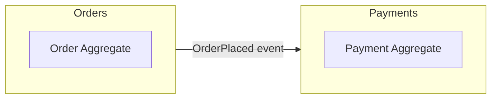
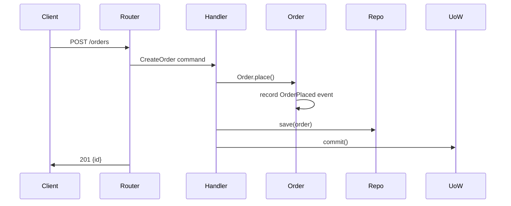

# py-ddd

DDD development companion for Python projects. Handles code generation, architecture
review, testing, and design in a single skill.

## Modes

This skill operates in four modes based on what the user asks for:

1. **Code** — generate DDD-compliant code (entities, commands, repos, endpoints)
2. **Review** — check code for DDD violations and anti-patterns
3. **Test** — generate tests following DDD testing pyramid
4. **Arch** — event storming, bounded context design, diagrams, ADRs

---

## Mode: Code

### Trigger

User asks to create/add an entity, aggregate, value object, domain event, command,
query, repository, service, API endpoint, or full feature across all layers.

### Before Writing Code

1. Read the project's `CLAUDE.md` to understand conventions and package name.
2. Identify which layer(s) need new files.
3. Read `references/layer-recipes.md` for the exact pattern to follow per layer.
4. Read `references/full-feature-recipe.md` when creating a full feature across all layers.

### Generation Principles

- Generate files in dependency order: domain -> application -> infrastructure -> presentation
- Each file must respect import rules from CLAUDE.md
- Domain layer: stdlib only (dataclasses, uuid, datetime, typing, enum, abc)
- Application layer: domain + typing.Protocol only
- Infrastructure layer: domain + application + third-party
- Presentation layer: application + pydantic + fastapi
- Every entity gets identity equality via base Entity class
- Every value object is frozen dataclass
- Every aggregate root extends AggregateRoot base, collects events
- Every port is a typing.Protocol in application/ports/
- Every repository impl goes in infrastructure/persistence/repositories/
- Every command handler is a standalone async function, not a class method
- Register new routers in main.py

### What NOT to Generate

- Do NOT put Pydantic models in domain layer
- Do NOT put SQLAlchemy in domain or application layer
- Do NOT create "service" classes with 10+ methods — split into command handlers
- Do NOT return ORM models from repositories — map to domain entities
- Do NOT skip type hints

---

## Mode: Review

### Trigger

User says `/review`, `/review <path>`, "review this code", "check my architecture",
"find violations", or "code review".

### Process

1. **Determine scope** — if path given, review that file/directory. Otherwise review `src/`.
2. Read project's `CLAUDE.md` for conventions.
3. Read `references/review-checklist.md` for the full checklist of rules.
4. Analyze code against the checklist. Classify findings:
   - CRITICAL — Architecture violation (wrong layer dependency, domain impurity)
   - WARNING — Pattern violation (anemic model, god service, missing events)
   - SUGGESTION — Style/improvement (naming, file size, missing type hints)

### Output Format

```markdown
## Review: <scope>

### Summary
- X critical | X warnings | X suggestions

### Findings

#### CRITICAL: <title>
**File:** `<path>`
**Line:** X
**Issue:** <description>
**Fix:** <concrete suggestion with code>

#### WARNING: <title>
...
```

If no issues found, say: "Clean — no DDD violations found."

After review, offer: "Want me to fix these issues? I'll start with critical ones."

---

## Mode: Test

### Trigger

User says `/test <target>`, "write tests for X", "add tests", "test strategy".

### Process

1. **Identify target** — specific file, feature name, or "test strategy" for full plan.
2. Read `references/test-recipes.md` for patterns per layer.
3. **Determine test type:**

| Target layer | Test location | Mocking strategy |
|---|---|---|
| domain/entities/ | tests/unit/domain/ | No mocks. Pure logic. |
| domain/value_objects/ | tests/unit/domain/ | No mocks. Validation. |
| application/commands/ | tests/unit/application/ | Mock all ports (repos, UoW) |
| application/queries/ | tests/unit/application/ | Mock read repos |
| infrastructure/repos/ | tests/integration/ | Real DB (testcontainers) |
| presentation/api/ | tests/integration/ | Real HTTP (httpx AsyncClient) |

4. Generate test file in correct location.
5. Add factory functions to `tests/factories.py` if new entities involved.

### Testing Principles

- Test behavior, not implementation: call entity methods, assert outcomes
- Domain tests NEVER touch DB or use mocks — pure Python
- Application tests mock ports: create fake repo that returns domain entities
- Integration tests use testcontainers for real Postgres
- Factory functions over raw constructors: `make_order()` not `Order(id=..., ...)`
- One assertion focus per test, clear test names: `test_order_cannot_be_placed_twice`
- Arrange-Act-Assert structure

---

## Mode: Arch

### Trigger

- `/arch <topic>` — general architecture discussion or analysis
- `/adr <title>` — create Architecture Decision Record
- "event storming", "design feature" — decompose requirements into DDD blocks
- "bounded context", "context map" — bounded context analysis
- "diagram", "visualize" — generate Mermaid diagrams

### Event Storming Process

Read `references/event-storming-guide.md`, then:

1. Ask user for business requirements or feature description
2. Extract Domain Events (things that happen): `OrderPlaced`, `PaymentReceived`
3. Identify Commands (what triggers events): `PlaceOrder`, `ProcessPayment`
4. Find Aggregates (who handles commands): `Order`, `Payment`
5. Map Bounded Contexts — group related aggregates
6. Output Mermaid diagram + list of files to generate (use Code mode)

### ADR

Create Architecture Decision Record in `docs/adr/`:

```markdown
# <number>. <Title>

**Status:** Proposed | Accepted | Deprecated | Superseded
**Date:** <today>

## Context
<Why is this decision needed?>

## Decision
<What was decided?>

## Consequences
<What are the trade-offs?>
```

Number = next available in `docs/adr/` directory.

### Diagrams

Generate Mermaid diagrams. Types:

**Bounded Context Map:**


**Command Flow:**


### Analyze Existing Code

When user asks to analyze existing code architecture:
1. Scan `src/` directory structure
2. Check import graph for layer violations
3. Identify bounded contexts (top-level modules)
4. List aggregates, their events, and commands
5. Generate context map diagram
6. Report any architectural concerns
