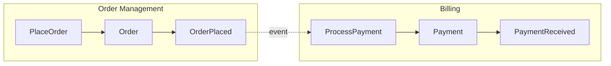

# Event Storming Guide

## How to Run Event Storming with Claude

Event Storming is a workshop technique for discovering domain events and
decomposing requirements into DDD building blocks. With Claude, it works
as a structured conversation.

## Step 1: Collect Requirements

Ask the user to describe the feature or business process. Prompt with:
- "What happens in this process from start to finish?"
- "What are the key outcomes?"
- "Who are the actors? (users, systems, scheduled jobs)"
- "What can go wrong?"

## Step 2: Extract Domain Events

Events are facts that happened. Named in past tense.

Questions:
- "What important things happen in this process?"
- "What would a business person care about tracking?"
- "What triggers notifications or downstream actions?"

Output format:
```
Events:
- OrderPlaced
- PaymentReceived
- PaymentFailed
- OrderShipped
- OrderDelivered
```

## Step 3: Identify Commands

Commands trigger events. Named in imperative.

Questions:
- "What action causes each event?"
- "Who or what initiates this action?"

Output format:
```
Commands -> Events:
- PlaceOrder -> OrderPlaced
- ProcessPayment -> PaymentReceived | PaymentFailed
- ShipOrder -> OrderShipped
- ConfirmDelivery -> OrderDelivered
```

## Step 4: Find Aggregates

Aggregates handle commands and enforce invariants.

Questions:
- "What entity is responsible for this command?"
- "What data needs to be consistent together?"

Output format:
```
Aggregates:
- Order (handles: PlaceOrder, ConfirmDelivery)
- Payment (handles: ProcessPayment)
- Shipment (handles: ShipOrder)
```

## Step 5: Group into Bounded Contexts

Bounded contexts group related aggregates that share a ubiquitous language.

Questions:
- "Which aggregates are closely related?"
- "Could different teams own different groups?"
- "Do any terms mean different things in different contexts?"

Output format:
```
Bounded Contexts:
- OrderManagement: Order, OrderLine
- Billing: Payment, Invoice
- Shipping: Shipment, TrackingInfo
```

## Step 6: Identify Context Relationships

How bounded contexts communicate:

```
Context Relationships:
- OrderManagement --[OrderPlaced event]--> Billing
- Billing --[PaymentReceived event]--> Shipping
- Shipping --[OrderShipped event]--> OrderManagement (update status)
```

## Step 7: Output

Generate:
1. **Mermaid diagram** — bounded context map with event flows
2. **File list** — what files to create (use Code mode)
3. **ADR** — if this involves a significant architectural decision

### Example Mermaid Output



### Example File List Output

```
Files to generate:

domain/events/order_events.py     -> OrderPlaced, OrderDelivered
domain/entities/order.py           -> Order (aggregate root)
application/commands/place_order.py -> PlaceOrder + handler
application/ports/order_repository.py -> OrderRepository(Protocol)
infrastructure/persistence/models/order_model.py -> OrderModel
infrastructure/persistence/repositories/order_repo.py -> SqlAlchemyOrderRepository
presentation/schemas/order_schemas.py -> PlaceOrderRequest, OrderResponse
presentation/api/v1/orders.py      -> router
```

## AI Service Specific Patterns

For AI/ML services, common bounded contexts include:

- **AgentManagement** — Agent configuration, lifecycle, capabilities
- **TaskExecution** — Task queue, execution state, results
- **PromptManagement** — Prompt templates, versions, A/B testing
- **ConversationHistory** — Messages, sessions, memory
- **ToolRegistry** — Available tools, their schemas, execution adapters
- **ModelGateway** — LLM provider abstraction, routing, fallbacks

Common events in AI services:
- `TaskSubmitted`, `TaskStarted`, `TaskCompleted`, `TaskFailed`
- `AgentCreated`, `AgentConfigUpdated`
- `ToolExecuted`, `ToolFailed`
- `ConversationStarted`, `MessageReceived`, `ResponseGenerated`
